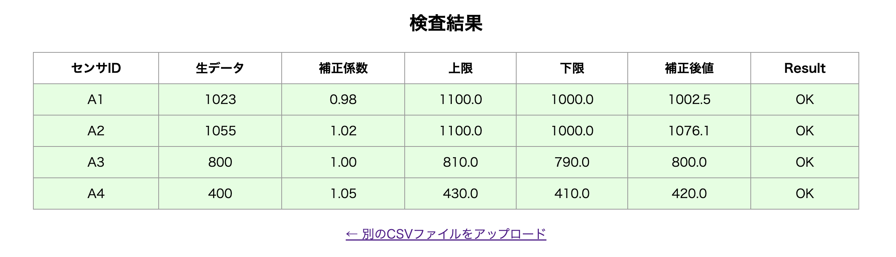

# 📊 CSVロガー検証ツール

製造ラインや組込機器などから出力される**CSVログファイル**をアップロードし、  
各行のデータに対して補正値の計算・許容範囲の判定を行い、OK／NGを色付きで表示するWebツールです。



---

## 🔧 主な機能

-  CSVファイルのアップロードと解析（Apache Commons CSV使用）
-  補正係数による演算（`補正後値 = 生データ × 補正係数`）
-  上限・下限との比較で **OK／NG** を判定
-  OK：緑色、NG：赤色でハイライト表示
-  ブラウザだけで利用可能（インストール不要）

---

## 💡 画面イメージ

### アップロード画面


### 結果表示画面


---

## 📥 対応CSVフォーマット

```csv
センサID,生データ,補正係数,上限,下限
A1,1023,0.98,1100,1000
A2,1055,1.02,1100,1000
A3,800,1.0,810,790
A4,400,1.05,430,410
```

---

## 📐 検査ロジック

- 補正後値 = 生データ × 補正係数 を計算
- 補正後値 が 下限 ～ 上限 に収まっていれば OK、そうでなければ NG
- 補正後値・判定結果を含めて表形式で表示

---

## 🛠️ 使用技術
| 項目      | 内容                     |
| ------- | ---------------------- |
| フレームワーク | Spring Boot (Java 17)  |
| CSV処理   | Apache Commons CSV     |
| テンプレート  | Thymeleaf              |
| UI      | HTML / CSS（簡易）         |
| ビルドツール  | Maven                  |
| 開発エディタ  | IntelliJ IDEA / VSCode |

---

## 🚀 ローカルでの起動手順（Mac想定）
- ① Java 17 をインストール（Homebrew）
brew install openjdk@17
.zshrcに以下を追加してパスを通す：

export PATH="/opt/homebrew/opt/openjdk@17/bin:$PATH"
- ② このリポジトリをクローン
git clone https://github.com/your-username/csv-validator.git
cd csv-validator
- ③ プロジェクトを起動
./mvnw spring-boot:run
（初回は依存解決のため少し時間がかかります）

- ④ ブラウザで表示
http://localhost:8080

---

## 📁 ディレクトリ構成

- src/
- ├── main/
- │　　├── java/com/example/csvvalidator/
- │　　│　　└── CsvValidationController.java
- │　　└── resources/
- │　　　　　├── templates/
- │　　　　　│　　├── upload.html
- │　　　　　│　　└── result.html
- │　　　　　└── application.properties
- └── pom.xml

---

## 🌱 今後の拡張アイデア

- 結果を CSV / JSON でダウンロード
- 異常検知グラフの表示
- 入力ルールの外部化（JSON/YAML）
- 検査履歴の保存（DB接続）

---

## 👤 作成者
GitHub：https://github.com/Nakagawa-Shota-tech
